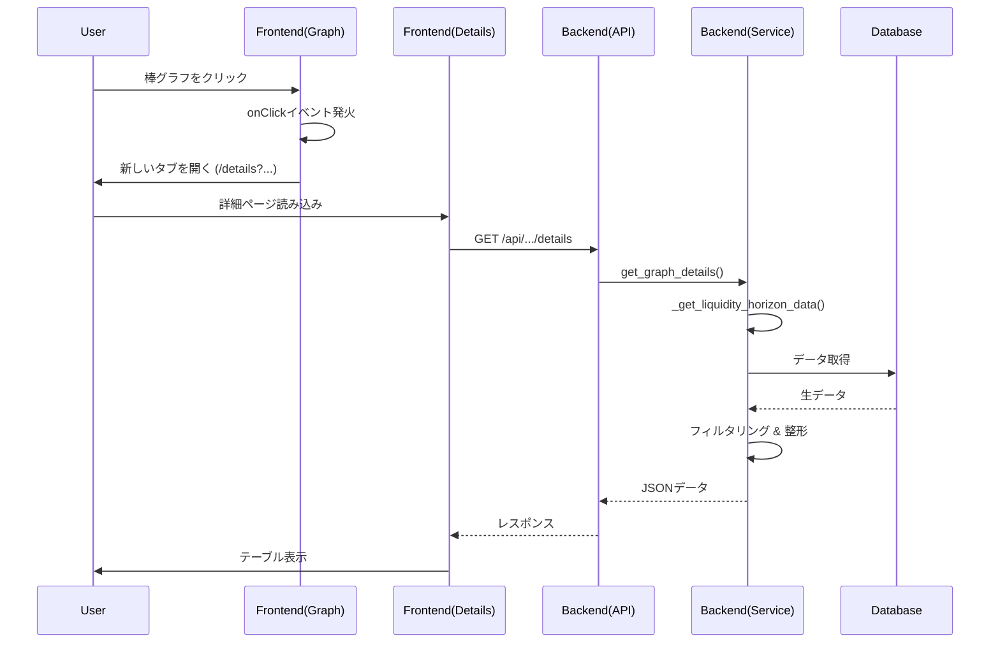

# Liquidity Horizon 詳細ビュー機能 構造解説書

本ドキュメントでは、Allocation Matrix の「Liquidity Horizon」グラフにおけるドリルダウン（詳細表示）機能の技術的構造について解説します。

## 1. 概要

ユーザーが棒グラフの特定の要素（資産サブタイプ）をクリックした際に、その要素を構成する個別の資産リストを表示する機能です。再利用性とメンテナンス性を考慮し、他のグラフでも同様の詳細表示ができるような汎用的な設計を採用しています。

## 2. アーキテクチャ概要

### データフロー図

## 3. バックエンド構造 (`app/routes/`)

バックエンドは、グラフ描画用のロジックと詳細取得用のロジックで共通部分を切り出し、API エンドポイントを通してデータを提供します。

### 3.1 `Allocation_Matrix_service.py` (ビジネスロジック)

このファイルが最も重要なロジックを担当しています。

- **`_get_liquidity_horizon_data(df_collection_latest, df_asset_attribute)` [重要]**

  - **役割**: データベースから生データを取得し、「資産名」「資産額」「償還日」「資産サブタイプ」を含む基本データセット（DataFrame）を作成する**共通関数**です。
  - **工夫点**: 元々は `_build_liquidity_horizon` 内にあったロジックをこの関数として切り出しました。これにより、グラフ描画時と詳細表示時で、全く同じデータ定義（Single Source of Truth）を参照できるようになり、データの不整合を防いでいます。

- **`get_graph_details(graph_id, params)` [新規]**
  - **役割**: 詳細データを返すためのパブリック関数です。
  - **処理フロー**:
    1.  `graph_id`（今回は 'liquidity_horizon'）に基づいて処理を分岐します。
    2.  `_get_liquidity_horizon_data` を呼んで全量データを取得します。
    3.  `params` 内の `sub_type` でデータをフィルタリングします。
    4.  フロントエンドに返すための軽量な JSON 形式（辞書リスト）に変換します。

### 3.2 `routes_Allocation_Matrix.py` (API 定義)

- **`GET /details` [新規]**
  - **役割**: フロントエンドからのリクエストを受け付ける窓口です。
  - **パラメータ**:
    - `graph_id`: どのグラフの詳細か（例: `liquidity_horizon`）
    - `sub_type`: どのカテゴリか（例: `Domestic Equity`）
  - 上記の `get_graph_details` を呼び出し、結果を JSON で返します。

---

## 4. フロントエンド構造 (`frontend/src/`)

React を使用し、コンポーネントの責務を分離しています。

### 4.1 `components/GraphContainer.jsx` (グラフ描画ラッパー)

- **役割**: Plotly のグラフを描画する汎用コンテナです。
- **変更点**: `onPlotClick` という新しいプロパティ（Prop）を受け取れるようにしました。これにより、グラフの種類ごとに異なるクリック時の動作を親コンポーネントから注入できます。
- **動作**: グラフ内の要素がクリックされると、Plotly のイベントデータを `onPlotClick` コールバックに渡します。

### 4.2 `pages/AllocationMatrix.jsx` (メインページ)

- **役割**: 複数のグラフを配置し、ページ全体を管理します。
- **`handlePlotClick` 関数**:
  - クリックされたグラフが「Liquidity Horizon」である場合のみ動作します。
  - クリックデータから「資産サブタイプ名（例: Domestic Equity）」を取得します。
  - `window.open` を使用して、詳細ページへの URL (`/allocation_matrix/liquidity_horizon/details?sub_type=...`) を新しいタブで開きます。

### 4.3 `pages/AllocationMatrixDetails.jsx` (詳細ページ) [新規]

- **役割**: 詳細データを表示するためだけの専用ページです。
- **動作**:
  1.  **URL パラメータ解析**: URL から `graphId` とクエリパラメータ `sub_type` を読み取ります。
  2.  **データ取得**: `useEffect` フック内で、バックエンドの API (`/details`) を呼び出します。
  3.  **表示**: 取得したデータを HTML テーブルとして描画します。
  4.  **言語対応**: ヘッダーやメッセージは日本語ですが、データの中身（資産サブタイプ名）やタイトル内の参照名は、データの整合性を保つためソース（英語）のまま表示するよう制御しています。

### 4.4 `App.jsx` (ルーティング)

- 新しいルート `/allocation_matrix/:graphId/details` を定義し、詳細ページコンポーネントにマッピングしました。

## 5. 設計のポイント（まとめ）

1.  **ロジックの共通化（DRY 原則）**:
    バックエンドでデータ取得ロジックを関数化し、グラフと詳細リストで完全に同じデータソースを使うようにしました。これにより「グラフとリストで数字が合わない」というバグを防ぎます。

2.  **汎用的な詳細エンドポイント**:
    `/details` というエンドポイントは `graph_id` を引数に取る設計にしています。今後、「ポートフォリオ効率性マップ」など他のグラフでも詳細表示が必要になった場合、同じエンドポイント構造を使って拡張できます。

3.  **疎結合なフロントエンド**:
    `GraphContainer` はクリックされたことだけを通知し、具体的な画面遷移ロジックは親の `AllocationMatrix` が持ちます。これにより、`GraphContainer` は他の場所でも使い回せます。
